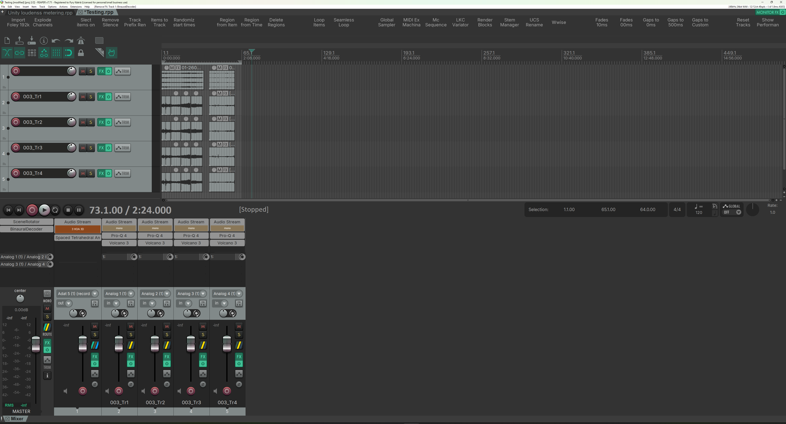

# Spaced Tetra Encoder (JSFX)

A Reaper JSFX plugin for encoding a four channel spaced tetrahedral microphone array into AmbiX, first order through tenth order.

> **Status:** alpha, Reaper only.
> VST3, AU, and CLAP versions are on the roadmap. The JSFX is published now so the technique is available to anyone with Reaper while the cross-host plugins are in development.

*screenshot placeholder: plugin GUI overview*

## Contents

- [Why a spaced array](#why-a-spaced-array)
- [What this plugin does](#what-this-plugin-does)
- [Install](#install)
- [Recording setup](#recording-setup)
- [Array presets and capsule placement](#array-presets-and-capsule-placement)
- [Hardware and 3D printed mounts](#hardware-and-3d-printed-mounts)
- [Plugin controls](#plugin-controls)
- [Workflow in Reaper](#workflow-in-reaper)
- [Technical notes](#technical-notes)
- [Limitations](#limitations)
- [Roadmap](#roadmap)
- [License](#license)
- [Support the project](#support-the-project)

---

## Why a spaced array

The Wikipedia article on ambisonics lists, among the technique's known downsides, that conventional ambisonics is *"unable to deliver the particular spaciousness of spaced omnidirectional microphones preferred by many classical sound engineers and listeners"* and is *"prone to strong coloration from comb filtering artifacts due to high coherence of neighbouring loudspeaker signals at lower orders"* ([Wikipedia: Ambisonics](https://en.wikipedia.org/wiki/Ambisonics)). This project is a direct response to those two limitations. The idea is to keep the rotatable, decoder-agnostic, head-trackable workflow of ambisonics while recapturing the spaciousness that spaced omnidirectional techniques have always had.

Every ambisonic microphone has physical spacing between its capsules. The "coincident" label is shorthand for "close enough that a single-point model is a workable approximation." On a typical first order tetrahedral mic the capsules sit roughly one to two centimetres apart, which already puts the spatial aliasing frequency inside the audible band. Above that frequency the coincident encoding model is doing its best with a signal it can no longer fully resolve, and the cancellations and recombinations that produce the familiar "ambisonic sound" are partly artefacts of the math working against the physics.

A spaced tetrahedral array sits in the other direction. The capsules are placed far enough apart that inter-capsule time and level differences carry real spatial information, and the encoder uses that information directly rather than averaging it away.

In practice this gives:

- **No close-spacing comb filtering.** The capsules are not being summed and differenced as if they were a single point, so the destructive interference patterns characteristic of near-coincident processing do not appear.
- **Natural spaciousness.** Reverberant tails and ambience keep the decorrelation that the recording space actually produced, instead of being collapsed into a point and re-derived from gradient signals.
- **Wider sweet spot.** The reconstructed soundfield is more forgiving of off-centre listening positions, both for monitoring and for distributed playback.
- **Honest physics.** No array is truly coincident. Spaced arrays acknowledge the spacing and work with it.

The tradeoff is at high frequencies. Spatial aliasing scales with capsule distance, so a wider array has a lower spatial Nyquist than a tight one, and in theory this should degrade directional resolution in the top octaves. In practice the interaural time and level differences encoded in the spaced signal appear to do useful perceptual work alongside the directional reconstruction. Informal listening so far suggests the practical localisation hit is smaller than the theory predicts, and the difference between third and seventh order on the same recording is large and clearly audible. Formal localisation tests against established encoders are on the to-do list.

## What this plugin does

Takes four input channels (one per capsule of a spaced tetrahedral array), applies the array geometry you select, and outputs AmbiX conformant B-format up to tenth order. Source mode flips the convention so the same array can be used either pointing outward at the scene or surrounding the listener and being pointed inward.

The tenth order ceiling is intentional. Common ambisonic toolchains today (IEM, SPARTA) cap at seventh order, which is more than enough for most production work and storage budgets. The plugin supports up to tenth so the underlying technique is not the bottleneck if and when other tools catch up.

## Install

Drop `SpacedTetraEncoder.jsfx` into your Reaper effects folder:

- **macOS:** `~/Library/Application Support/REAPER/Effects/`
- **Windows:** `%APPDATA%\REAPER\Effects\`
- **Linux:** `~/.config/REAPER/Effects/`

(In Reaper: Options > Show REAPER resource path in explorer/finder, then open the `Effects` folder.)

The plugin appears in the FX browser under JS as `SpacedTetraEncoder`. Place it on a track that carries the four capsule signals.

## Recording setup

You need:

- Four microphones with matched or known characteristics. The reference setup uses omnidirectional small-diaphragm capsules (specifically the Primo EM272Z1 in Clippy XLR housings, see [Hardware](#hardware-and-3d-printed-mounts)). Omnis are a natural fit for this technique because directional information is recovered from inter-capsule time and level differences rather than from the capsules' inherent directivity. Cardioid or sub-cardioid capsules work too; the encoder is pattern-agnostic, but the character of the result will shift.
- A way to mount them in a tetrahedral arrangement. Two presets are included (see below), 3D printable mounts are in `hardware/`, and custom geometries are supported.
- A four channel interface or some way to record four simultaneous channels to a multitrack file.

Route the capsules to the plugin in this order:

| Plugin channel | Capsule  |
| -------------- | -------- |
| Ch 1           | Mic 1    |
| Ch 2           | Mic 2    |
| Ch 3           | Mic 3    |
| Ch 4           | Mic 4    |

Mic numbering for each preset is described below.

## Array presets and capsule placement

The placement convention uses a right-hand mnemonic. Hold your right hand with thumb, index finger, and middle finger mutually perpendicular (like an x-y-z axis demo); the ring finger is treated as an implicit fourth direction. Each finger indicates the orientation of one capsule.

## The two array designs

Both designs mount on a standard microphone stand, but the geometries and use cases are different.

### Alt-Azimuth (radial, outside-array only)

A central 3D printed hub piece sits on top of the stand. Four threaded rods thread into the hub and radiate outward in the right-hand-rule tetrahedral pattern. Each rod terminates in a gripper that holds a capsule.

"Forward" is whatever you want the front of the recording to be (typically the subject).

- **Use case:** recording the space around the array. The array sits in the room and looks outward at the scene.
- **Source mode in plugin:** `Normal`.
- **Robustness:** the load is distributed across four rods meeting at a solid hub. Sturdier than the Stand-Mount design and the more forgiving choice for travel or field work.
- **Limitation:** the radial layout fills the centre of the array, so there is no usable interior space. This design cannot be used for inside-array (inverse) recording.

*photo placeholder: Alt-Azimuth array assembled*

| Mic | Finger         | Direction       |
| --- | -------------- | --------------- |
| 1   | thumb          | back, up        |
| 2   | index          | forward, up     |
| 3   | middle         | left, down      |
| 4   | ring (implied) | right, down     |

### Stand-Mount (open tetrahedron, inside or outside)

The Mic 3 piece sits at the bottom of the assembly and carries the stand-mount thread. Mic 3 itself extends downward from this piece, pointing straight at the floor. The tetrahedron *builds upward* from the Mic 3 piece: aluminium rods connect the Mic 3 vertex to three upper vertex pieces, and additional rods connect the upper vertices to each other, forming the three upper edges of the tetrahedron. Mics 1, 2, and 4 sit on the upper vertices following the right-hand-rule layout (back/left, forward, and back/right respectively).

The interior of the tetrahedron is hollow, which is what makes the inverse use case physically possible: you can place a source (a person, an instrument, a vibrating object) inside the array and record from four surrounding directions at once.

- **Use case:** either recording the space around the array (outside-array) *or* recording a source placed inside the array (inside-array).
- **Source mode in plugin:** `Normal` for outside-array, `Inverse` for inside-array.
- **Robustness:** the tetrahedron is held together at the vertices by relatively thin aluminium rods, so this design is more fragile than the Alt-Azimuth and needs more care in handling.

*photo placeholder: Stand-Mount array assembled*

| Mic | Finger         | Direction        |
| --- | -------------- | ---------------- |
| 1   | thumb          | back, left       |
| 2   | index          | forward          |
| 3   | middle         | straight down    |
| 4   | ring (implied) | back, right      |

### Custom

If neither preset matches your rig, set **Array Preset** to Custom and enter azimuth and elevation for each capsule directly. Useful for asymmetric arrays, larger spacings, or experimental geometries.

## Hardware and 3D printed mounts

STL files for both array presets are in [`hardware/`](hardware/). The current designs are built around:

- A central threaded rod (Finnish hardware stores sell it as *kierretanko*; any equivalent M-thread rod works) acting as the structural spine.
- Per-capsule holder pieces that thread onto the rod and grip the microphone.
- A removable end piece that does the actual gripping, separate from the rod-mount piece.

The grippers are sized for **Clippy EM272Z1 capsules** (the small omnidirectional Primo capsule used in Micbooster's Clippy XLR series, including their 4-matched set). Because the grippers are separable from the rod-mount, you can substitute a different end piece for a different mic without redesigning the rest of the structure. If you have CAD experience and a different microphone you want to use, contributions of replacement gripper STLs are welcome. Open a pull request with your part and a short note on which mic it fits.

The parts are sized to fit small printers. The reference build was printed on a **Flashforge Finder 2.0** with a 14 × 14 × 14 cm build volume. Anything that size or larger should be fine.

A detailed print and build guide will be added to `hardware/` later. Until then: files are STL ready to slice, PETG is what they have been tested in, and assembly is by hand around the threaded rod.

> **Version one caveat.** These mounts are proof of concept parts. They work, they have been used in real sessions, and they are good enough to start recording. They are not finished objects. Even printed in PETG the pieces are somewhat fragile, wall thicknesses and stress relief are not yet tuned. A v2 redesign focused on durability and assembly ergonomics is on the roadmap. Use the current files as a starting point and treat the parts gently.

## Plugin controls

*screenshot placeholder: controls panel*

| Control | Description |
| ------- | ----------- |
| **Source Mode** | `Normal` for recording the space around the array (array points outward). `Inverse` for recording from inside the array (array surrounds the scene and points inward). |
| **Normalization** | SN3D (AmbiX default), N3D, or FuMa. Match this to the convention used by your downstream decoder. |
| **Array Preset** | Alt-Azimuth, Stand-Mount, or Custom. See above. |
| **Array Yaw / Pitch / Roll** | Pre-encoding rotation of the array. Use to correct mounting orientation so "forward" in the encoded field matches the intended forward direction. Applied *before* encoding, so this is geometry compensation, not head-tracking. |
| **Master Gain** | Output trim. |
| **Channel Trims (1 to 4)** | Per-capsule gain. Use to compensate for unmatched mics or pad capsules that are clipping. |
| **Channel Mutes (1 to 4)** | Per-capsule mute, useful for diagnosis. |
| **Custom AZ + EL (1 to 4)** | Capsule azimuth and elevation, only active when Array Preset is set to Custom. |

For headtracking, place a separate rotator plugin *after* the encoder (IEM SceneRotator is a good reference). The pre-encoding rotation in this plugin is for fixed array orientation only.

## Workflow in Reaper

1. Record four channels, one per capsule, in the channel order above. Either four mono tracks or one four channel track works.
2. If you used four mono tracks, route them into a four channel folder or bus.
3. Insert `SpacedTetraEncoder` on the four channel track. Set the track channel count to at least the number of channels needed for your target order: 4 for 1oA, 9 for 2oA, 16 for 3oA, and so on up to 121 for 10oA.
4. Set Array Preset and Source Mode to match how you recorded.
5. Trim or mute individual capsules if needed.
6. Send the encoded B-format to your decoder of choice (IEM, SPARTA, etc.) on a downstream track or master.

*screenshot placeholder: example Reaper session*

## Technical notes

- **Channel ordering:** ACN (AmbiX).
- **Normalisation:** SN3D by default, with N3D and FuMa selectable. FuMa is only meaningful at first order and is provided for compatibility with legacy material.
- **Maximum order:** 10. Channel counts per order follow `(N+1)^2`: 4, 9, 16, 25, 36, 49, 64, 81, 100, 121 for orders 1 through 10. In current production toolchains 7 (64 channels) is the practical ceiling.
- **Sample rate:** any rate Reaper supports.
- **Latency:** zero processing latency. Encoding is sample-by-sample with no internal buffering.

## Limitations

- Reaper only for now.
- No internal headtracking; pair with a downstream rotator plugin.
- No HRTF binaural rendering inside the plugin; route the encoded B-format to an external binaural decoder (IEM BinauralDecoder, SPARTA Ambi Bin, etc.).
- Formal localisation testing against coincident reference encoders is pending.
- At wider capsule spacings the spatial aliasing frequency drops; choose your array size with this in mind.
- v1 hardware parts are functional but fragile; see [Hardware](#hardware-and-3d-printed-mounts).

## Roadmap

- **Plugins**
  - VST3, AU, and CLAP versions of the encoder.
  - Companion rotator plugin.
  - 8 channel input variant for second order spaced arrays.
  - 16 channel input variant for third order spaced arrays.
- **Hardware**
  - v2 mount redesign with better durability and assembly.
  - STLs for 8 capsule and 16 capsule arrays.
  - Reference build guide with bill of materials and print settings.
  - Community submitted gripper end pieces for additional microphones.
- **Research and validation**
  - Formal listening tests and localisation measurements against coincident references.
  - Documented field recordings as reference material.

## License

- **Code** (`SpacedTetraEncoder.jsfx`): [MIT](LICENSE).
- **Documentation, images, and hardware designs** (`docs/`, `images/`, `hardware/`): [Creative Commons Attribution 4.0 International](LICENSE-CC-BY-4.0).

Use it in commercial work. Attribution is appreciated but not required by the MIT license; for documentation and hardware, attribution is required by CC-BY 4.0.

## Support the project

Development is carried by Calm Base Oy in Jyväskylä, Finland. The plugins are and will remain free and open source. Donations help fund hardware, build infrastructure, and continued development.

## Credits

- Pyry Kääriä
- Thanks to the wider open source ambisonic community for the tools and documentation that make work like this possible, particularly the IEM and SPARTA groups.
