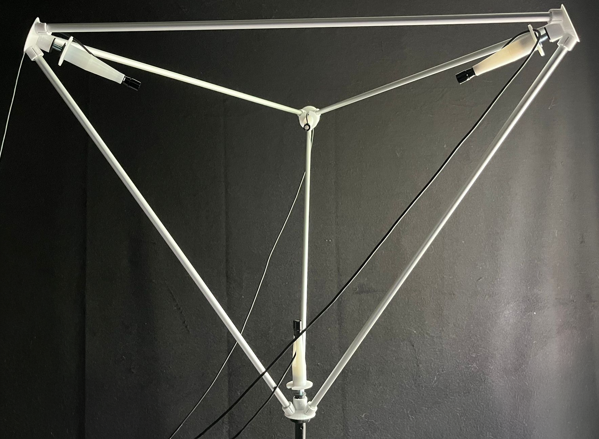
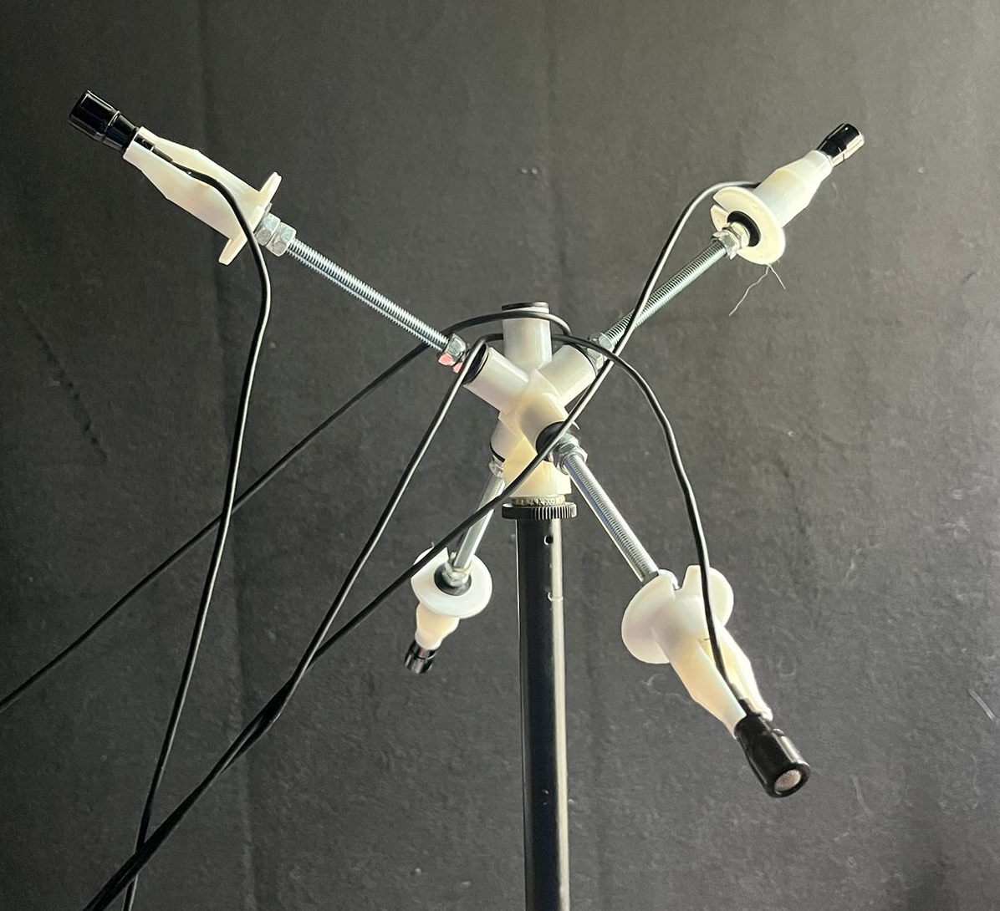
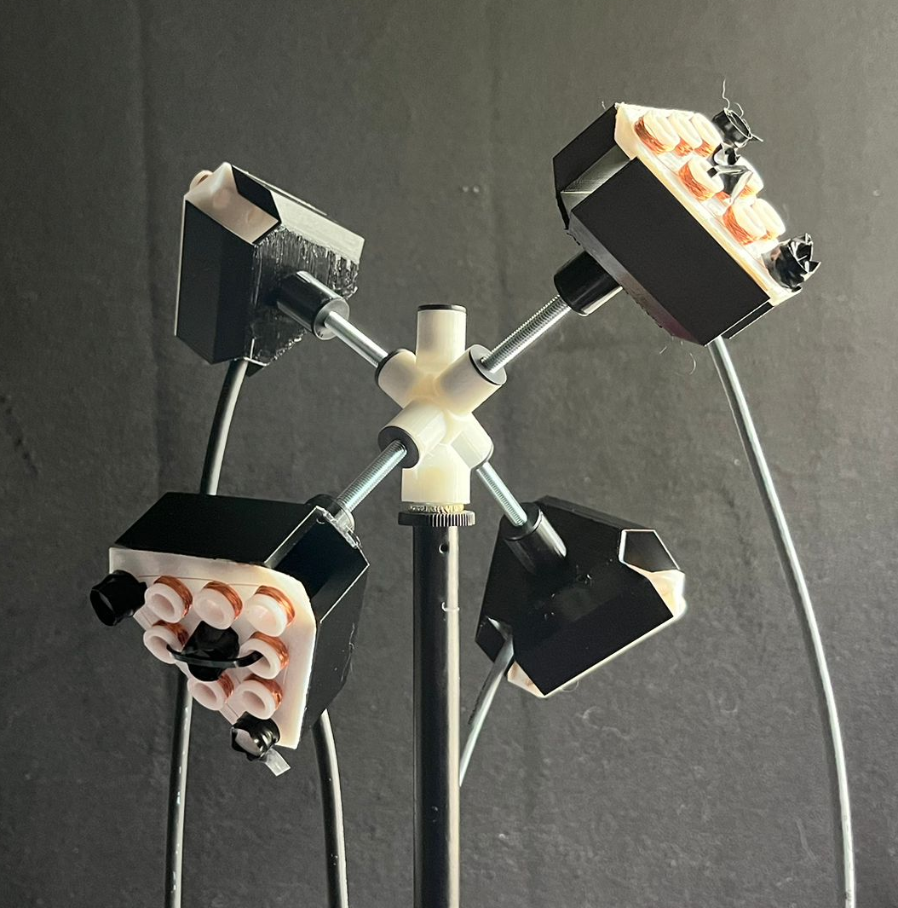
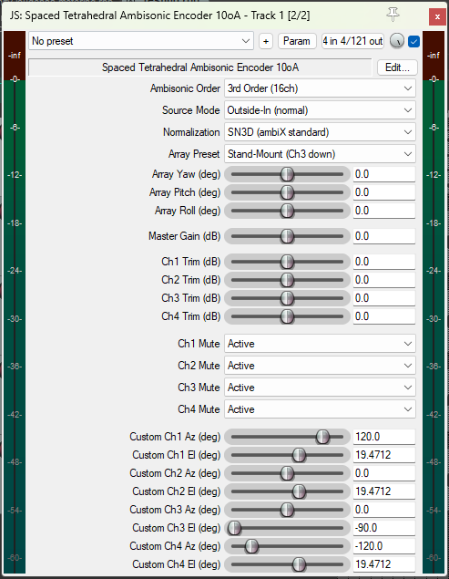

# Spaced Ambisonics

Open source plugins and hardware for spaced tetrahedral ambisonic recording. A workflow that recaptures the spaciousness of spaced microphone techniques inside a fully rotatable, decoder-agnostic, sensor-agnostic, head-trackable ambisonic pipeline.

> **Status:** alpha, Reaper only, 4 channel input.
> VST3, AU, and CLAP versions are on the roadmap, as are 8 and 16 channel input variants for second and third order arrays. The JSFX is published now so the technique is available to anyone with Reaper while the cross-host plugins are in development.

<table align="center">
  <tr>
    <td align="center">
      <br>
      <em>Stand-Mount — "Inverse" Ambisonics</em>
    </td>
    <td align="center">
      <br>
      <em>Alt-Azimuth — "Normal" Ambisonics</em>
    </td>
  </tr>
  <tr>
    <td align="center">
      <br>
      <em>Electromagnetic Ambisonics</em>
    </td>
    <td align="center">
      <br>
      <em>TetraEncoder Plugin</em>
    </td>
  </tr>
</table>

## Contents

- [Why a spaced array](#why-a-spaced-array)
- [What's in this repo](#whats-in-this-repo)
- [Recording setup](#recording-setup)
- [Array presets and capsule placement](#array-presets-and-capsule-placement)
- [Hardware and 3D printed mounts](#hardware-and-3d-printed-mounts)
- [Roadmap](#roadmap)
- [License](#license)
- [Support the project](#support-the-project)

---

## Why a spaced array

The Wikipedia article on ambisonics lists, among the technique's known downsides, that conventional ambisonics is *"unable to deliver the particular spaciousness of spaced omnidirectional microphones preferred by many classical sound engineers and listeners"* and is *"prone to strong coloration from comb filtering artifacts due to high coherence of neighbouring loudspeaker signals at lower orders"* ([Wikipedia: Ambisonics](https://en.wikipedia.org/wiki/Ambisonics)). This project is a direct response to those two limitations.

Every ambisonic microphone has physical spacing between its capsules. The "coincident" label is shorthand for "close enough that a single-point model is a workable approximation." On a typical first order tetrahedral mic the capsules sit roughly one to two centimetres apart, which already puts the spatial aliasing frequency inside the audible band. Above that frequency the coincident encoding model is doing its best with a signal it can no longer fully resolve, and the cancellations and recombinations that produce the familiar "ambisonic sound" are partly artefacts of the math working against the physics.

A spaced tetrahedral array sits in the other direction. The capsules are placed far enough apart that inter-capsule time and level differences carry real spatial information, and the encoder uses that information directly rather than averaging it away.

In practice this gives:

- **No close-spacing comb filtering.** The capsules are not being summed and differenced as if they were a single point, so the destructive interference patterns characteristic of near-coincident processing do not appear.
- **Natural spaciousness.** Reverberant tails and ambience keep the decorrelation that the recording space actually produced, instead of being collapsed into a point and re-derived from gradient signals.
- **Wider sweet spot.** The reconstructed soundfield is more forgiving of off-centre listening positions, both for monitoring and for distributed playback.
- **Honest physics.** No array is truly coincident. Spaced arrays acknowledge the spacing and work with it.

The tradeoff is at high frequencies. Spatial aliasing scales with capsule distance, so a wider array has a lower spatial Nyquist than a tight one, and in theory this should degrade directional resolution in the top octaves. In practice the interaural time and level differences encoded in the spaced signal appear to do useful perceptual work alongside the directional reconstruction. Informal listening so far suggests the practical localisation hit is smaller than the theory predicts, and the difference between third and seventh order on the same recording is large and clearly audible. Formal localisation tests against established encoders are on the to-do list.

---

## What's in this repo

```
plugins/    JSFX encoder and Reaper session setup script
hardware/   STL files for 3D printed array mounts
images/     Photos and screenshots used in documentation
```

See [`plugins/README.md`](plugins/README.md) for plugin install instructions, controls reference, and Reaper workflow.

---

## Recording setup

You need:

- Four sensors with matched or known characteristics. The plugin is sensor-agnostic: any transducer that produces an audio-range signal and can be mounted at a tetrahedral vertex will work. Practical options include:
  - **Acoustic microphones** — the reference setup uses omnidirectional small-diaphragm capsules (Primo EM272Z1 in Clippy XLR housings). Omnis are a natural fit because directional information comes from inter-capsule time and level differences rather than from capsule directivity. Cardioids work too; the character of the result shifts.
  - **Electromagnetic (EMI) sensors** — hand-wound search coils for recording spatial EM fields. See [`hardware/stl/grippers/emi-mic/`](hardware/stl/grippers/emi-mic/) for the build guide.
  - **Hydrophones** — for underwater spatial recording. Standard hydrophone output routes to a preamp input the same way as any other sensor.
  - **Ultrasonic transducers** — for recording outside the audible band, useful for bat detection or material analysis. The encoder is sample-rate agnostic; run Reaper at the appropriate rate.
  - **Any other sensor** that produces four channels of audio-range signal and can be physically mounted at the tetrahedral vertices.
- A way to mount four sensors in a tetrahedral arrangement. Two presets are included (see below), 3D printable mounts are in `hardware/`, and custom geometries are supported.
- A four-channel interface suitable for your sensor type.

Route the capsules to the encoder in this order:

| Plugin channel | Capsule |
| -------------- | ------- |
| Ch 1           | Mic 1   |
| Ch 2           | Mic 2   |
| Ch 3           | Mic 3   |
| Ch 4           | Mic 4   |

Mic numbering for each preset is described below.

---

## Array presets and capsule placement

The placement convention uses a right-hand mnemonic. Hold your right hand with thumb, index finger, and middle finger mutually perpendicular (like an x-y-z axis demo); the ring finger is treated as an implicit fourth direction. Each finger indicates the orientation of one capsule.

### Stand-Mount (Ch 3 down)

One capsule points straight down so the array can mount on a standard mic stand through the bottom capsule's holder. Geometry is the right-hand layout rotated so the middle finger axis is vertical.


| Mic | Finger         | Direction     |
| --- | -------------- | ------------- |
| 1   | thumb          | back, left    |
| 2   | index          | forward       |
| 3   | middle         | straight down |
| 4   | ring (implied) | back, right   |

### Alt-Azimuth (radial, stand-mounted from hub)

A central hub piece sits on top of the stand and four threaded rods radiate outward from it. Use when you want a symmetric distribution and outside-array recording only.


| Mic | Finger         | Direction   |
| --- | -------------- | ----------- |
| 1   | thumb          | back, up    |
| 2   | index          | forward, up |
| 3   | middle         | left, down  |
| 4   | ring (implied) | right, down |

"Forward" is whatever you want the front of the recording to be (typically the subject).

### Custom

If neither preset matches your rig, set **Array Preset** to Custom in the encoder and enter azimuth and elevation for each capsule directly. Useful for asymmetric arrays, larger spacings, or experimental geometries.

---

## Hardware and 3D printed mounts

STL files for both array presets are in [`hardware/`](hardware/). The current designs are built around:

- A central threaded rod (Finnish hardware stores sell it as *kierretanko*; any equivalent M-thread rod works) acting as the structural spine.
- Per-capsule holder pieces that thread onto the rod and grip the microphone.
- A removable end piece that does the actual gripping, separate from the rod-mount piece.

The grippers are sized for **Clippy EM272Z1 capsules** (the small omnidirectional Primo capsule used in Micbooster's Clippy XLR series, including their 4-matched set). Because the grippers are separable from the rod-mount, you can substitute a different end piece for a different mic without redesigning the rest of the structure. If you have CAD experience and a different microphone you want to use, contributions of replacement gripper STLs are welcome. Open a pull request with your part and a short note on which mic it fits.

The parts are sized to fit small printers. The reference build was printed on a **Flashforge Finder 2.0** with a 14 × 14 × 14 cm build volume. Anything that size or larger should be fine.

A detailed print and build guide will be added to `hardware/` later. Until then: files are STL ready to slice, PETG is what they have been tested in, and assembly is by hand around the threaded rod.

> **Version one caveat.** These mounts are proof of concept parts. They work, they have been used in real sessions, and they are good enough to start recording. They are not finished objects. Even printed in PETG the pieces are somewhat fragile, wall thicknesses and stress relief are not yet tuned, and small drops can crack them. A v2 redesign focused on durability and assembly ergonomics is on the roadmap. Use the current files as a starting point and treat the parts gently.

---

## Roadmap

- **Plugins**
  - VST3, AU, and CLAP versions of the encoder.
  - Companion rotator plugin.
  - 8 channel input variant for second order spaced arrays.
  - 16 channel input variant for third order spaced arrays.
- **Hardware**
  - v2 mount redesign with better durability and assembly.
  - STLs for 8 capsule and 16 capsule arrays.
  - Reference build guide with bill of materials and print settings.
  - Community submitted gripper end pieces for additional microphones.
- **Research and validation**
  - Formal listening tests and localisation measurements against coincident references.
  - Documented field recordings as reference material.

---

## License

- **Code** (`plugins/`): [MIT](LICENSE).
- **Documentation, images, and hardware designs** (`images/`, `hardware/`): [Creative Commons Attribution 4.0 International](LICENSE-CC-BY-4.0).

Use it in commercial work. Attribution is appreciated but not required by the MIT license; for documentation and hardware, attribution is required by CC-BY 4.0.

---

## Support the project

Development is carried by Calm Base Oy in Jyväskylä, Finland. The plugins are and will remain free and open source. Donations help fund hardware, build infrastructure, and continued development.

[](https://ko-fi.com/pkaaria)

## Credits

- Pyry Kääriä
- Thanks to the wider open source ambisonic community for the tools and documentation that make work like this possible, particularly the IEM and SPARTA groups.
